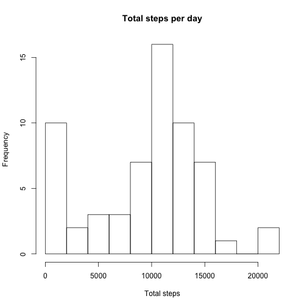
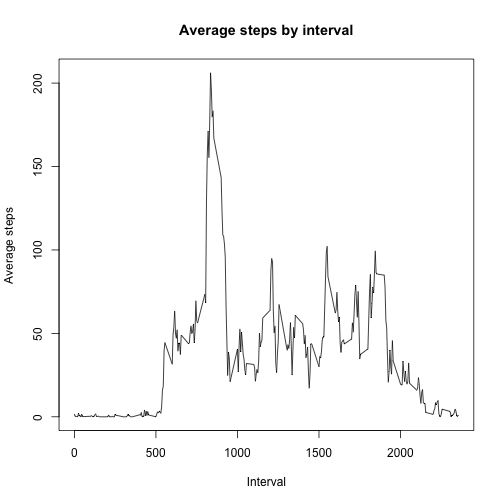
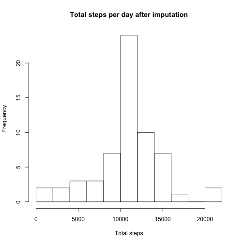
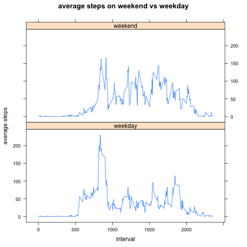

```r
sessionInfo()
```

```
## R version 3.2.1 (2015-06-18)
## Platform: x86_64-apple-darwin13.4.0 (64-bit)
## Running under: OS X 10.10.5 (Yosemite)
## 
## locale:
## [1] en_US.UTF-8/en_US.UTF-8/en_US.UTF-8/C/en_US.UTF-8/en_US.UTF-8
## 
## attached base packages:
## [1] stats     graphics  grDevices utils     datasets  methods   base     
## 
## other attached packages:
## [1] knitr_1.11      lattice_0.20-31 lubridate_1.3.3 dplyr_0.4.2    
## 
## loaded via a namespace (and not attached):
##  [1] Rcpp_0.12.0     digest_0.6.8    assertthat_0.1  grid_3.2.1     
##  [5] R6_2.1.0        plyr_1.8.3      DBI_0.3.1       formatR_1.2    
##  [9] magrittr_1.5    evaluate_0.7.2  stringi_0.5-5   lazyeval_0.1.10
## [13] rmarkdown_0.8   tools_3.2.1     stringr_1.0.0   yaml_2.1.13    
## [17] parallel_3.2.1  memoise_0.2.1   htmltools_0.2.6
```

## Loading and preprocessing the data


```r
unzip("activity.zip")
activity <- read.csv("activity.csv")

activity$date <- as.Date(activity$date)
```

## What is mean total number of steps taken per day?

### Calculate the total number of steps taken per day


```r
activity.by_day <-
    group_by(activity, date) %>%
    summarize(total_steps = sum(steps, na.rm = TRUE))
```

### Make a histogram of the total number of steps taken each day


```r
hist(
    activity.by_day$total_steps,
    breaks = 10,
    main = "Total steps per day",
    xlab = "Total steps")
```

 

### Calculate and report the mean and median of the total number of steps taken per day


```r
mean(activity.by_day$total_steps, na.rm = TRUE)
```

```
## [1] 9354.23
```


```r
median(activity.by_day$total_steps, na.rm = TRUE)
```

```
## [1] 10395
```

## What is the average daily activity pattern?

### Make a time series plot of the 5-minute interval and the average number of steps taken, averaged across all days


```r
activity.by_interval <-
    group_by(activity, interval) %>%
    summarize(average_steps = mean(steps, na.rm = TRUE))

plot(
    activity.by_interval$interval,
    activity.by_interval$average_steps,
    type = "l",
    main = "Average steps by interval",
    xlab = "Interval",
    ylab = "Average steps")
```

 

### Which 5-minute interval, on average across all the days in the dataset, contains the maximum number of steps?


```r
activity.by_interval[
    activity.by_interval$average_steps
        == max(activity.by_interval$average_steps), ]
```

```
## Source: local data frame [1 x 2]
## 
##   interval average_steps
## 1      835      206.1698
```

## Imputing missing values

### Calculate and report the total number of missing values in the dataset


```r
sum(is.na(activity$steps))
```

```
## [1] 2304
```

### Devise a strategy for filling in all of the missing values in the dataset

Will use the average for the interval for missing values for that interval. The average for the interval was calculated earlier, first will join the two data frames.


```r
activity.strategy_missing_values <-
    inner_join(activity, activity.by_interval, by = "interval")
```

### Create a new dataset that is equal to the original dataset but with the missing data filled in

Check if the number of steps is NA, and use the average if so. Otherwise, just reuse the number of steps. Finally, select the columns of interest (can drop average_steps at this point).


```r
activity.fill_missing <-
    mutate(activity.strategy_missing_values,
           steps = ifelse(is.na(steps), average_steps, steps)) %>%
    select(steps, date, interval)
```

### Make a histogram of the total number of steps taken each day and calculate and report the mean and median total number of steps taken per day


```r
activity.by_day.after_imputation <-
    group_by(activity.fill_missing, date) %>%
    summarize(total_steps = sum(steps, na.rm = TRUE))

hist(
    activity.by_day.after_imputation$total_steps,
    breaks = 10,
    main = "Total steps per day after imputation",
    xlab = "Total steps")
```

 

```r
mean(activity.by_day.after_imputation$total_steps)
```

```
## [1] 10766.19
```

```r
median(activity.by_day.after_imputation$total_steps)
```

```
## [1] 10766.19
```

#### Do these values differ from the estimates from the first part of the assignment?

Yes.

#### What is the impact of imputing missing data on the estimates of the total daily number of steps?

Using this imputation strategy, the mean and median are now the same. The mean has increased and the median has decreased; in addition the mean has increased more than the median has decreased.

After imputation, the distribution appears closer to a normal distribution.

## Are there differences in activity patterns between weekdays and weekends?

### Create a new factor variable in the dataset with two levels – “weekday” and “weekend”


```r
activity.fill_missing.add_factor <-
    mutate(activity.fill_missing,
           date.type = ifelse(
               weekdays(date, abbr = TRUE) %in% c("Sat", "Sun"),
               "weekend",
               "weekday"))
activity.fill_missing.add_factor$date.type <-
    as.factor(activity.fill_missing.add_factor$date.type)
```

### Make a panel plot containing a time series plot of the 5-minute interval (x-axis) and the average number of steps taken, averaged across all weekday days or weekend days (y-axis)


```r
activity.by_interval.by_date_type <-
    group_by(activity.fill_missing.add_factor, date.type, interval) %>%
    summarize(average_steps = mean(steps))

xyplot(
    average_steps ~ interval | date.type,
    data = activity.by_interval.by_date_type,
    type = "l",
    ylab = "average steps",
    main = "average steps on weekend vs weekday",
    layout = c(1, 2))
```

 
